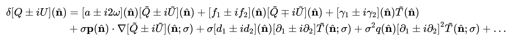

# 20240223

## Hermitian matrix decomposition [ EASY | MATH | LINEAR ALGEBRA ]

All hermitian matrix can be decomposed into the Pauli basis. This decomposition is fundamental in quantum mechanics and quantum information theory, as it allows the representation of quantum states and operators in a standardized form, facilitating analysis and computation.

## PAPER

### 

Changes in the Stokes parameter of the CMB due to distortions along the line-of-sight can be written as
