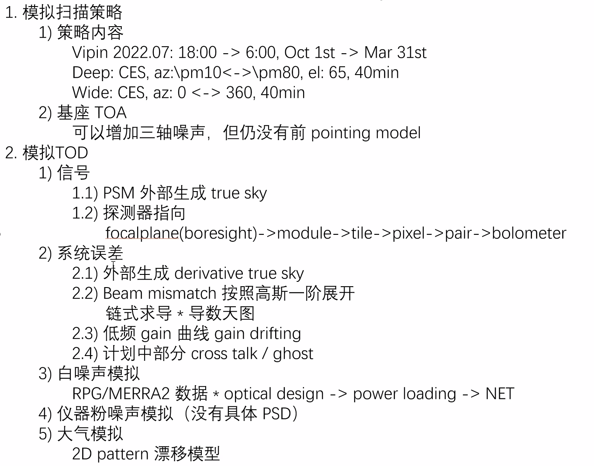
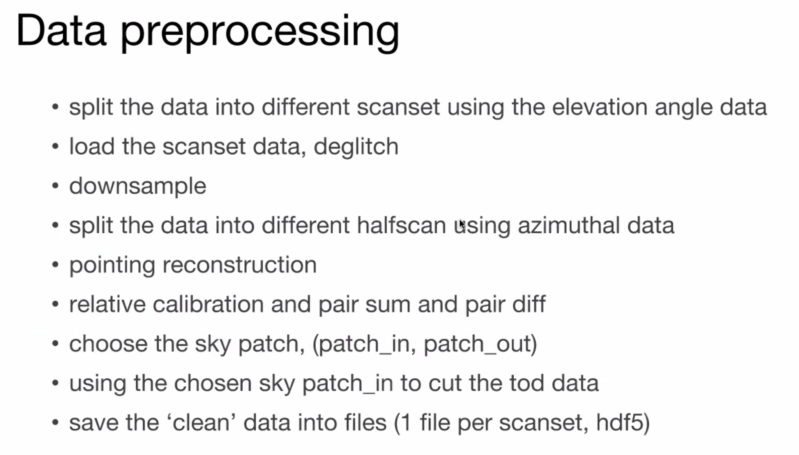

# 0228-Ali-first light

## First light \[ CMB | MEETING ]

BICEP pipeline and their thesis\
ACT thesis

 

### Matrix based pipeline

 

## CROW

what is the model of point sources. (beam profile, effective beam? and what is the variance in the chi square.(CMB+NOISE?))\
what do point sources catalog have in their data. how to consider its variability?\
why not using different ways to estimate the phetometry? \\

## MEMO

the method to reduce the ILC bias.(The Atacama Cosmology Telescope: High-resolution component-separated maps across one-third of the sky. arxiv:2307.01258)
