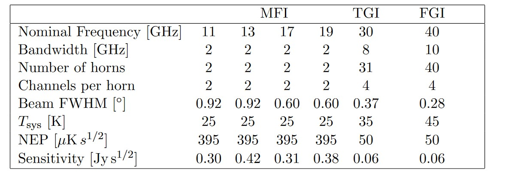

# 20240308

## QUIJOTE [ CMB ]
The QUIJOTE (Q-U-I JOint Tenerife) CMB Experiment is designed to observe the polarization of the Cosmic Microwave Background and other Galactic and extragalactic signals at medium and large angular scales in the frequency range of 10–40 GHz. The first of the two QUIJOTE telescopes and the multi-frequency (10–20 GHz) instrument have been in operation since November 2012. In 2014 a second telescope and a new instrument at 30 GHz will be ready for commissioning, and an additional instrument at 40 GHz is in its final design stages. After three years of effective observations, the data obtained by these telescopes and instruments will have the required sensitivity to detect a primordial gravitational-wave component if the tensor-to-scalar ratio is larger than r = 0.05. At the moment, we have completed half of the wide Galactic survey with the multi-frequency instrument covering 18 000 square degrees of the northern hemisphere. When we finish this survey in early 2014, we shall have reached ∼ 14μK per one degree beam at 11, 13, 17 and 19 GHz, in both Q and U.

