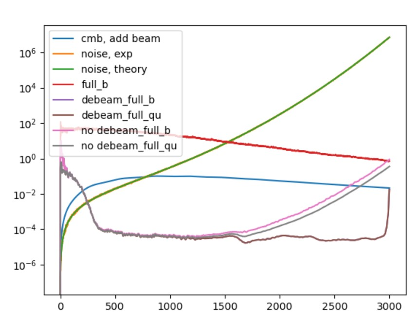
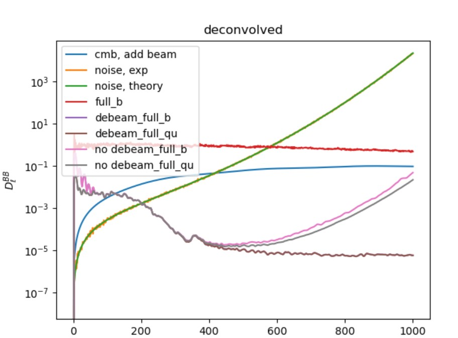

# 1015-215GHz and 95GHz / th noise power spectrum

## 215GHz


<figure><figcaption></figcaption></figure>

seems lmax occur after 3500, and $$\pi / \theta \approx 981.8$$&#x20;

```python
// noise theory power spectrum without beam
nl_th = (map_depth / bl)**2 / 3437.748**2
```

<figure><figcaption></figcaption></figure>

## 95GHz

<figure><figcaption></figcaption></figure>

