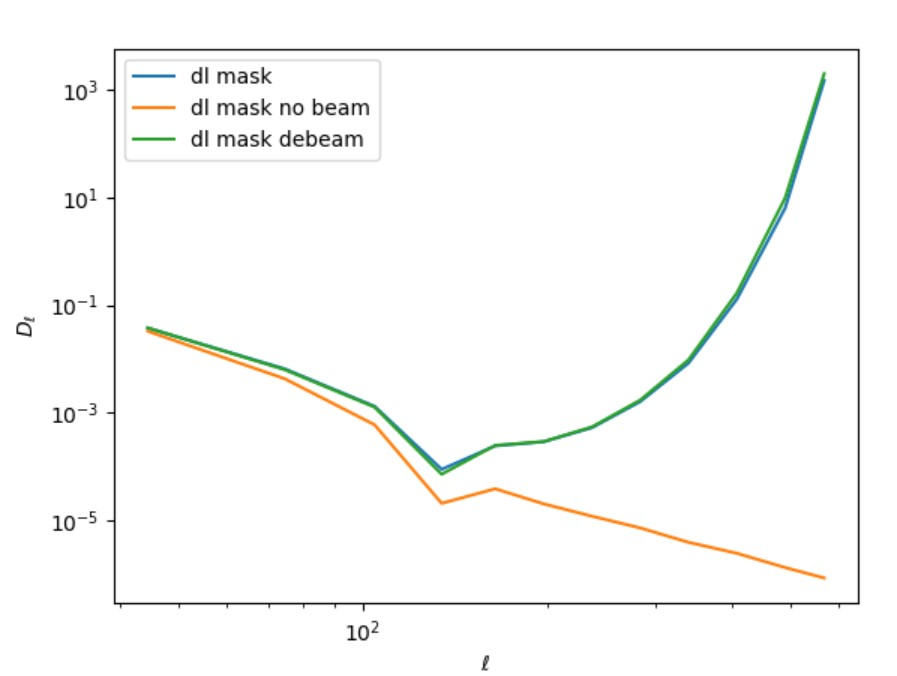
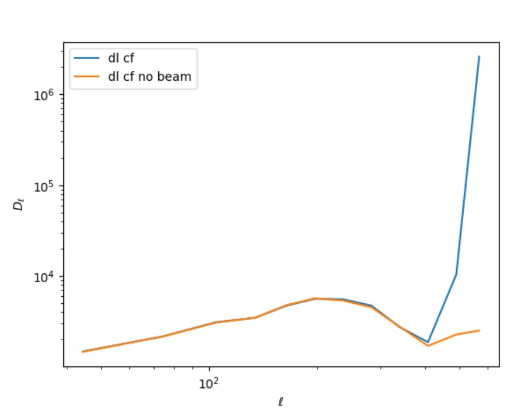
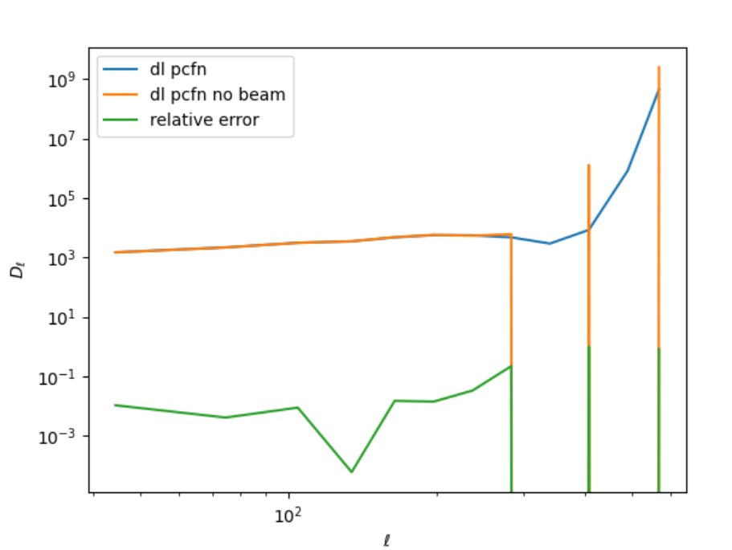

# 1029-mask small scale structure

<figure><figcaption>
mask itself
</figcaption></figure>

showing the raising power spectrum when estimate on no-convolved map is from the coupling between mask and beam.

<figure><figcaption>
cmb + diffuse fg
</figcaption></figure>

when l>400, relative error begin to exceed 5%

<figure><figcaption>
PS + FG + NOISE + CMB
</figcaption></figure>

showing it is hard to deconvolve map with point sources the do power spectrum estimation.
