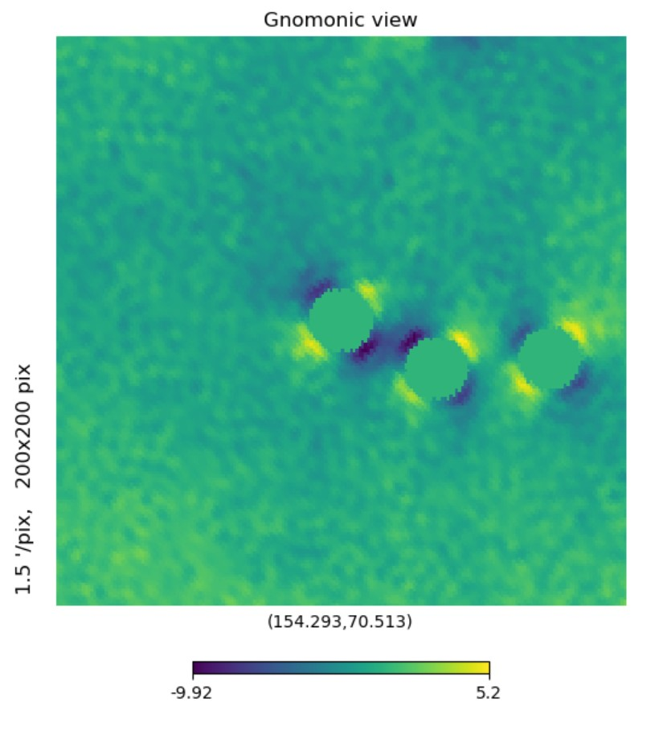
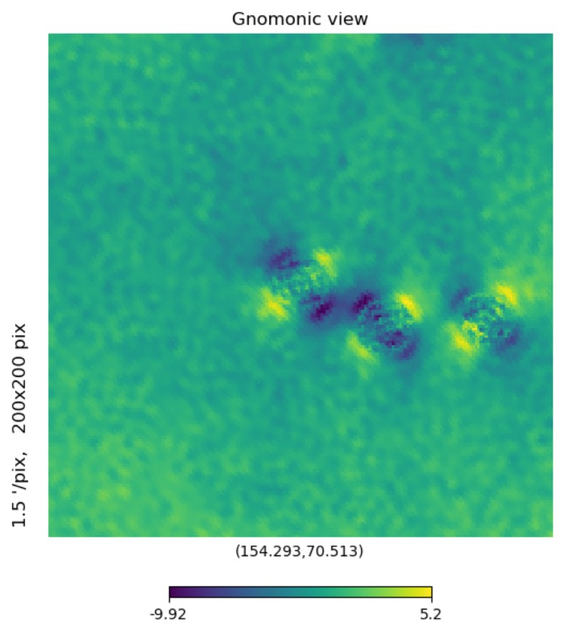

# 1031-inpainting debug

<figure><figcaption>
before inpaint
</figcaption></figure>

<figure><figcaption>
after inpaint
</figcaption></figure>

Maybe other inpainting method should be tested.

Also, it seems the EB leakage correction is not enough, so we have to figure out if we should add a bigger mask. We should see its performance first, if bigger mask are needed, see the effect scope of leakage!
